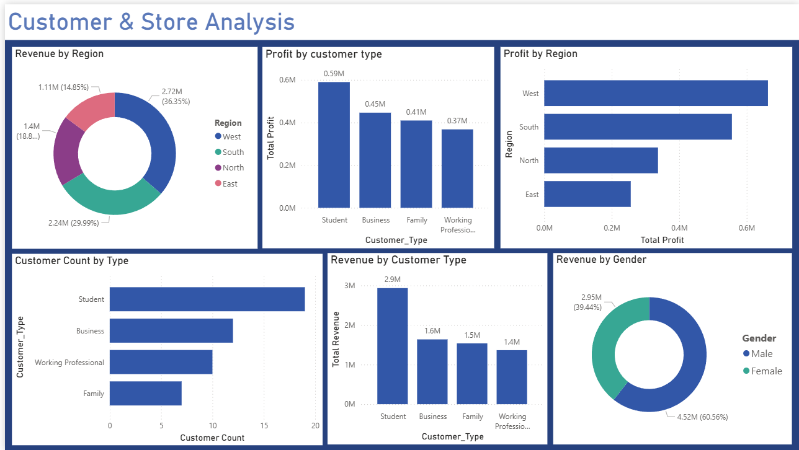
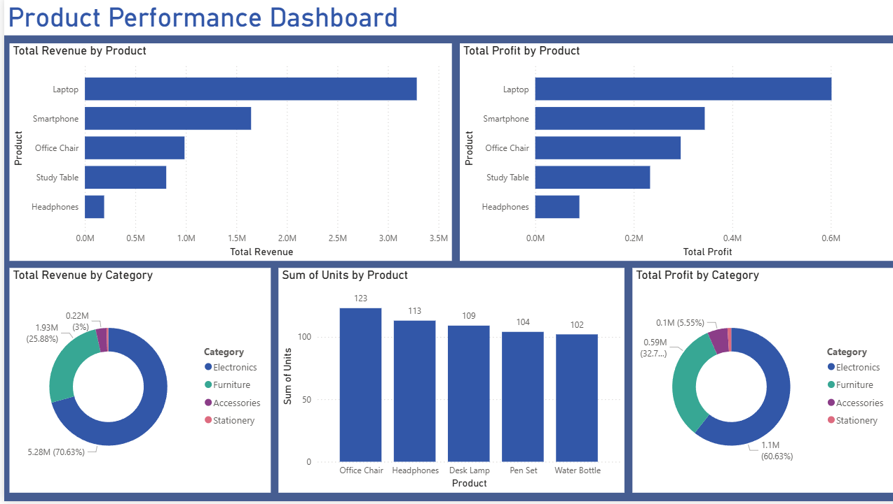

# Power BI Sales Analytics Dashboard

## Overview
This project analyzes sales performance using Power BI and provides business insights through interactive dashboards.

## Dashboard Pages

### 1. Sales Overview
- Revenue Trends
- Profit Analysis
- Category Performance

### 2. Customer & Store Analysis
- Customer Segmentation
- Gender Analysis
- Regional Performance

### 3. Product Performance Dashboard
- Revenue by Product
- Profit by Product
- Units Sold Analysis
- Category Performance

### 4. Executive Summary Dashboard
- KPI Cards
- Revenue Trends
- Regional Insights
- Customer Analysis

## Tools Used
- Power BI
- DAX
- Power Query
- Microsoft Excel

## Key Metrics
- Total Revenue: 7.47M
- Total Profit: 1.81M
- Units Sold: 1.125K
- Profit Margin: 24.27%

# Power BI Sales Analytics Dashboard

## Dashboard Screenshots

### Sales Overview Dashboard

### Customer & Store Analysis

### Product Performance Dashboard

### Executive Summary Dashboard

